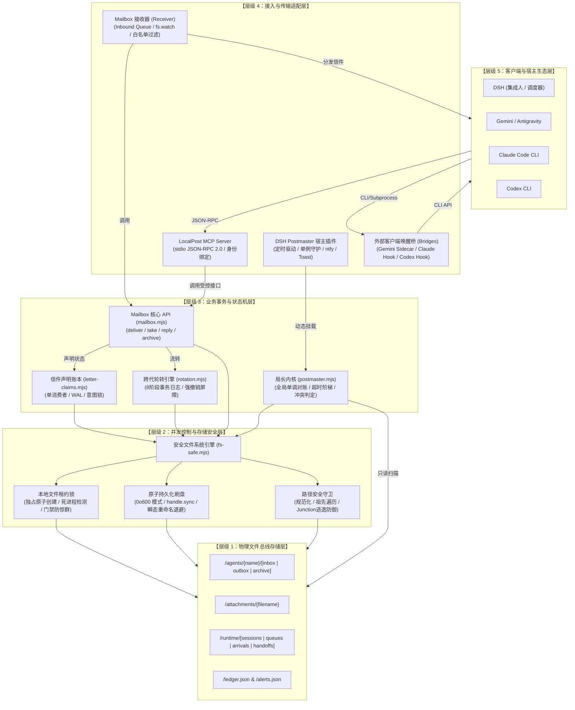
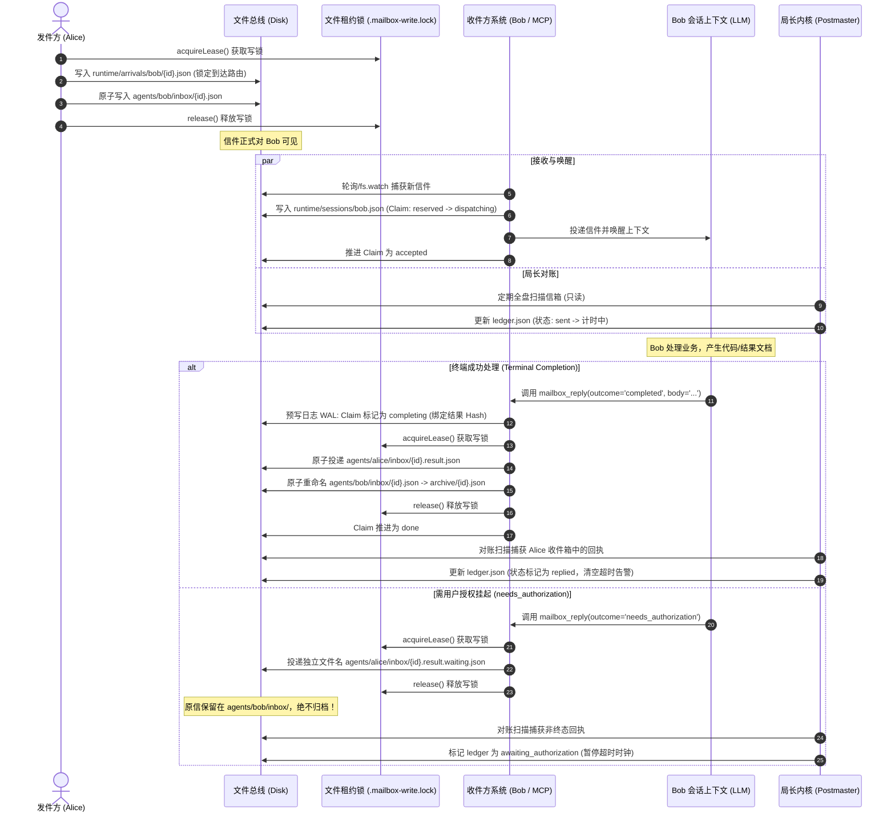
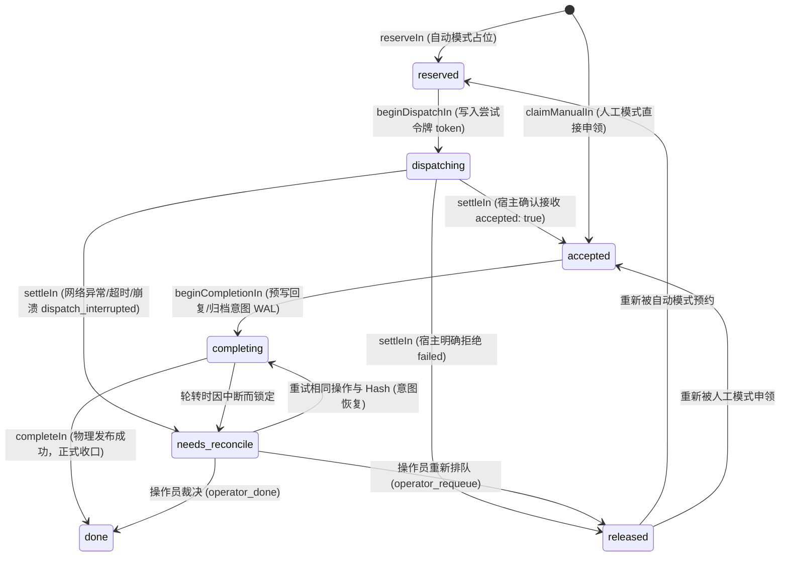
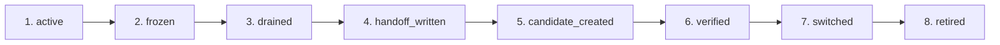

# LocalPost (邮局系统) 完整工程报告、设计蓝图与操作指南

> **文档版本**：v1.1（Gemini 草稿的公开审阅版，2026-10-08）
> **适用仓库**：`localpost-postmaster` (`https://github.com/Y-Niuniu/localpost-postmaster.git`)
> **运行环境**：建议 Node.js 24；package.json 声明 Node >=20，部分工具使用 import.meta.dirname。核心零外部 npm 依赖，包含针对 Windows 瞬态文件锁的处理；其他平台仍需各自验证
> **读者定位**：分布式系统工程师、多 Agent 协作系统开发者、底层架构学习者

> **文档来源与贡献**：本报告初稿由 Gemini 生成，2026-10-08 根据仓库源码进行静态审阅和修订。项目发起人主要负责需求与架构，代码主要由 AI 编码代理生成与迭代。
> **适用基线**：`12cb7fe24a210c6c0618de672715783556e983b9`。本文解释实现与设计边界，不是生产认证或本轮测试通过证明。
> **阅读方式**：正文中的目录、会话 ID 和身份均为部署示例，应替换为实际配置。历史运维记录与当前部署事实须另行核对。核心使用共享本地文件系统和本机 PID 检查，不承诺跨主机一致性或端到端 exactly-once 执行。
> **主要修订**：运行环境、并发和 WAL 的适用范围、退避总时长、备份术语与流程、两种 MCP 入口、通用命令、保守排障方式及私人会话标识。
---

## 目录
1. 系统概述与核心哲学
2. 总体架构与设计蓝图
   - 2.1 系统分层拓扑图
   - 2.2 存储与文件总线拓扑
   - 2.3 端到端信件全生命周期时序图
3. 核心算法与容错机制深度剖析
   - 3.1 本地多进程文件租约锁与陈旧锁恢复机制
   - 3.2 Windows 瞬态重命名退避与原子刷盘机制
   - 3.3 路径穿透与 Windows Junction/符号链接逃逸防御算法
   - 3.4 信件声明（Claims）与单消费者状态机（WAL）
   - 3.5 跨代会话轮转与强撤销屏障算法
   - 3.6 局长单调对账引擎与冲突判定算法
   - 3.7 到达路由绑定与接收器确定性调度
   - 3.8 引用集合标记-清理机制
   - 3.9 备份暂存散列清单校验与发布
   - 3.10 插件单例守护与告警冷却降噪算法
4. 详细使用说明书与运维手册 (Runbook)
   - 4.1 目录结构与规范
   - 4.2 配置文件规范 (`postmaster.config.json`)
   - 4.3 核心 CLI 运维命令速查
   - 4.4 Multi-Agent 人工与自动化协作协议
   - 4.5 MCP 服务器接入与工具调用指南
   - 4.6 跨宿主外部唤醒桥部署指南
   - 4.7 生产排障与灾难恢复 Runbook

---

## 一、系统概述与核心哲学

在多大型语言模型（Multi-Agent）协同的本地开发环境中，各个 Agent 往往运行在彼此隔离的宿主环境中（例如 DSH、Antigravity/Gemini、Claude Code CLI、Codex CLI 等）。部分协作方案使用 Redis、RabbitMQ、HTTP 服务或数据库。LocalPost 选择文件总线，以减少本地部署的服务依赖，并保留可以人工检查的通信记录。

**LocalPost（本地邮局系统）** 采用面向本地多进程协作的**纯文件系统通信总线（File-as-Bus）** 架构。

### 核心设计哲学
1. **零外部 npm 运行依赖 (Zero-Dependency ESM)**：
   全系统核心只使用 Node.js 原生内置模块（`node:fs`、`node:crypto`、`node:path`、`node:child_process`），不安装任何 npm 包，减少外部 npm 依赖带来的维护和供应链暴露面；这不等于不存在供应链风险。
2. **单一不可变事实源与信封只读原则 (Immutability & Single Source of Truth)**：
   信件信封（Envelope）一旦投递落地，内容与 ID 永远只读，不得原地修改。信箱内核（Postmaster Kernel）绝不主动移动、删除或篡改信件证据；内核仅通过扫描磁盘信箱生成派生账本（`ledger.json`）与告警集合（`alerts.json`）。
3. **预写式意图日志 (Write-Ahead Logging / WAL)**：
   受管信件的终态回执或归档在发布副作用前记录完成意图；会话轮转也分阶段持久记录。该机制依赖有效会话绑定与受管信件所有权，不能推广为所有信件或任意崩溃场景下的端到端 exactly-once 保证。
4. **闭门容错 (Fail-Closed Architecture)**：
   不确定派发、缺少撤销证据等状态可进入 `needs_reconcile`；路径越界或锁故障也可能直接拒绝操作并报错。不同错误的返回形式不同，不能认为所有异常都会自动写入同一个挂起状态。
5. **Windows NTFS 深度并发加固**：
   专为 Windows 开发环境下的 NTFS 文件锁特性、杀毒软件（如卡巴斯基 PDM、Windows Defender）扫描干扰、以及系统搜索索引器对刚解绑文件的短暂停留冲突设计了全套瞬态退避重试（Transient Backoff）与原子操作机制。

---

## 二、总体架构与设计蓝图

### 2.1 系统分层拓扑图

LocalPost 采用五层逻辑视图，用于说明模块职责；实际实现中的状态保证依赖相应调用路径、配置和宿主能力：



---

### 2.2 存储与文件总线拓扑

文件总线以 `C:/LocalPost/mailbox/` 为根目录，划分为严格的职责分区：

```
C:/LocalPost/mailbox/
├── README.md                     # 邮差规矩唯一源 (所有 Agent 共享的只读规约)
├── postmaster.config.json        # 全局配置 (超时阶梯、通知通道、冷却时间)
├── postmaster.mjs                # 局长内核对账器
├── ledger.json                   # 局长维护的派生账本（对消费者只读）
├── alerts.json                   # 局长维护的当前活动告警 (派生视图)
├── postmaster.log                # 局长运行审计日志 (按 1MB 自动轮转)
├── .mailbox-write.lock           # 全局写锁 (投递、归档、回复竞争保护)
├── .postmaster.lock              # 对账器运行独占租约锁
│
├── agents/                       # 各 Agent 的虚拟信箱
│   ├── dsh/
│   │   ├── inbox/                # 收件箱 (*.json)
│   │   ├── outbox/               # 发件历史 (可选存根)
│   │   └── archive/              # 归档箱 (*.json，由收件人处理后移入)
│   ├── gemini/
│   ├── claude/
│   └── codex/
│
├── attachments/                  # 共享只读附件存储区 (大文件、设计稿、测试输出)
│   └── ...
│
└── runtime/                      # 运行时状态数据 (受控状态机内部数据)
    ├── arrivals/                 # 到达路由事实绑定 (按收件人和信件 ID 存储)
    │   └── {agent}/{id}.json
    ├── sessions/                 # 会话绑定、声明与轮转日记
    │   └── {agent}.json
    ├── queues/                   # 接收器入队排队事实
    │   └── {agent}.json
    ├── handoffs/                 # 跨代轮转生成的交接快照
    │   └── {agent}/g{generation}.json
    ├── backups/                  # 增量快照备份区 (mail-backup 产生)
    └── snapshots/                # 账本重建前历史快照
```

---

### 2.3 端到端信件全生命周期时序图

以下展示跨 Agent 任务委派的标准生命周期时序：包含发件、到达绑定、接收声明、意图预写、回执发布以及原子归档。



---

## 三、核心算法与容错机制深度剖析

### 3.1 本地多进程文件租约锁与陈旧锁恢复机制 (`fs-safe.mjs`)

在无中心进程的多 Agent 环境中，实现强互斥通常极其脆弱：进程被强杀（SIGKILL / 任务管理器终止）会导致传统锁文件遗留，从而产生系统死锁。LocalPost 设计了一种**带进程活性探针与防惊群二阶段门禁的租约锁协议**。

#### 核心锁数据结构
锁文件（如 `.postmaster.lock`）通过 POSIX `O_CREAT | O_EXCL`（Node.js 中的 `'wx'` 模式）原子创建，权限锁定为 `0o600`，内部持久化规范 JSON：
```json
{
  "token": "4f9d2c18-7b2a-4a6c-9c3f-2d88194b1e5a",
  "pid": 14208,
  "started_at": 1728229410000
}
```

#### 算法流程与关键判定准则
1. **原子尝试获取**：
   通过 `fsp.open(file, 'wx', 0o600)` 尝试独占打开。若成功，写入上述数据，执行 `handle.sync()` 强制刷盘后返回成功，持有锁句柄及专属 `token`。
2. **锁失效判断（活体不剥夺准则）**：
   若文件已存在，解析其内部数据。判断旧锁是否为“陈旧锁”（Stale Lock）必须同时满足两个必要条件：
   $$\text{isStale}(L) \iff (\text{now} - L.\text{started\_at} > \text{staleMs}) \land \text{isDead}(L.\text{pid})$$
   其中 `isDead(pid)` 的检测算法为：
   ```javascript
   function dead(pid) {
     if (!Number.isSafeInteger(pid) || pid <= 0) return false;
     try { process.kill(pid, 0); return false; }
     catch (error) { return error.code === 'ESRCH'; }
   }
   ```
   > [!IMPORTANT]
   > **活体不剥夺准则 (A live owner is never stolen)**：只要操作系统的 PID 依然存活（未返回 `ESRCH`），即便其持有时间超过了配置的 `staleMs`（例如进行超大文件哈希计算或高负载 GC），系统也**绝对不会抢占该锁**！这防止了在慢 I/O 情况下发生脑裂。

3. **防惊群二阶段门禁锁恢复 (Two-Phase Reclaim Gate)**：
   若证实持有者已死亡且已超时，可能存在多个并发检测者同时试图删除陈旧锁。如果直接删除，会导致并发写入冲突。
   系统引入二级门禁文件 `${name}.reclaim`：
   ```mermaid
   flowchart TD
       A[检测到主锁超时且 PID 死亡] --> B{竞争创建 gateFile: name.reclaim}
       B -->|竞争失败| C[返回 recovery_busy_needs_reconcile，放弃抢占]
       B -->|竞争成功| D[成为唯一法定恢复者]
       D --> E[二次确认主锁依然陈旧]
       E --> F[原子 unlink 主锁文件]
       F --> G[释放 gateFile]
       G --> H{发起常规 createOwner 创建新主锁}
       H -->|成功| I[成功接管锁]
       H -->|失败| J[其他竞争者胜出，返回 busy]
   ```
   恢复门禁用于串行化符合回收条件的陈旧锁接管。

4. **幽灵锁释放保护 (`unlinkOwned`)**：
   在释放锁时，绝对禁止盲目调用 `unlink(file)`。锁内容可能已改变；释放时需要核对所有权，不能仅凭路径删除。活进程不会仅因持有时间超时被回收。
   释放时必须重读文件，比对 `current.token === token`。只有 Token 严格匹配才执行 `unlink`；若不匹配，坚决不删，避免摧毁新持有者的有效锁。

---

### 3.2 Windows 瞬态重命名退避与原子刷盘机制

在 Windows 操作系统中，NTFS 文件系统的文件锁特性与防病毒软件（如实时文件系统防护 PDM、文件索引器）会拦截刚关闭句柄的文件重命名，短时间内抛出 `EPERM`、`EACCES` 或 `EBUSY`。

#### 指数退避重命名 (`renameReplacing`)
系统定义了明确的瞬态错误集合：
$$\mathcal{E}_{\text{transient}} = \{\text{'EPERM'}, \text{'EACCES'}, \text{'EBUSY'}\}$$
重命名重试算法公式：
$$\Delta t_k = 5 \times 2^k\text{ ms}, \quad k \in [1, 7]$$
最多尝试 8 次，前 7 次失败后等待；累计退避时间（不含 I/O 执行耗时）：
$$\sum_{k=1}^7 5 \times 2^k = 5 \times (2^8 - 2) = 1270\text{ ms} \approx 1.27\text{ s}$$
代码实现：
```javascript
const TRANSIENT_RENAME = new Set(['EPERM', 'EACCES', 'EBUSY']);
export const RENAME_ATTEMPTS = 8;
async function renameReplacing(from, to) {
  for (let attempt = 1; ; attempt++) {
    try { return await fsp.rename(from, to); }
    catch (error) {
      if (!TRANSIENT_RENAME.has(error.code) || attempt >= RENAME_ATTEMPTS) throw error;
      await new Promise(resolve => setTimeout(resolve, 5 * 2 ** attempt));
    }
  }
}
```

#### 原子写刷盘 (`atomicWrite`)
为了防止进程在写文件途中掉电或崩溃导致目标文件留下半截乱码，`atomicWrite` 遵循严格的两阶段流程：
1. 在同一目录下生成临时文件：`${file}.${randomUUID()}.tmp`。
2. 以独占写权限 `'wx'` 打开，权限设置为 `0o600`。
3. 写入完整数据后，调用底层 `handle.sync()`（请求操作系统同步文件内容；不能单凭此声称任意掉电场景零丢失）。
4. 关闭句柄后，调用 `renameReplacing` 原子覆盖目标路径。
5. 在 `finally` 块中始终清理临时文件残留。

---

### 3.3 路径穿透与 Windows Junction/符号链接逃逸防御算法

在支持跨 Agent 调用的系统中，恶意或出错的 Agent 可能传入带有目录遍历（`../../`）或 Windows 符号链接（Symlink/Junction）的信件/附件路径，从而越权读写系统核心目录。

#### 防御算法流程 (`safePath`)
1. **词法快速拒绝**：
   - 拒绝绝对路径（`path.isAbsolute(relative)`）。
   - 拒绝盘符路径（`/^[A-Za-z]:/`）。
   - 拒绝词法包含 `..` 相对路径分段。
2. **规范化设备前缀解析**：
   Windows 下 `fs.realpathSync.native()` 在高并发重命名或解析时可能会返回长设备名前缀 `\\?\` 或 `\\?\UNC\`，这会导致常规路径字符比对失真。系统首先进行正规化：
   ```javascript
   const normalizeFinal = value => value.startsWith('\\\\?\\UNC\\') ? '\\\\' + value.slice(8)
     : value.startsWith('\\\\?\\') ? value.slice(4) : value;
   ```
3. **逐层重解析点 (Reparse Point) 深度核查**：
   单纯检查最终解析路径无法防御祖先目录被替换为符号链接的攻击。系统从 Base 目录开始，逐级步进拼接路径，并在每一级进行检测：
   ```javascript
   for (const segment of path.relative(base, target).split(path.sep).filter(Boolean)) {
     cursor = path.join(cursor, segment);
     try {
       if (fs.lstatSync(cursor).isSymbolicLink() &&
           !inside(realBase, normalizeFinal(fs.realpathSync.native(cursor)))) {
         throw new Error('Linked path escapes mailbox root');
       }
     } catch (error) { if (error.code !== 'ENOENT') throw error; }
   }
   ```
   只要任何中间目录是重解析点且真实目标脱离了信箱根目录，立即抛出致命异常。

---

### 3.4 信件声明（Claims）与单消费者状态机（WAL） (`letter-claims.mjs`)

为协调自动化派发（Auto Receiver）与受控人工申领（Manual Consumer），系统引入了声明账本（Claim Ledger）。通过受控路径处理的受管信件记录代际所有者（`owner: { generation, session }`）。未绑定会话、未建立受管到达路由或绕过受控接口的信件不适用全部 claim 保证。

#### 状态流转图



#### 关键机制
1. **预写式意图（Write-Ahead Completion）**：
   在真正调用 `mailbox.reply` 或 `mailbox.archive` 向磁盘写回执前，必须先在 Claim 中推进至 `completing`，并记录：
   $$\text{completion} = \{ \text{op: 'reply' | 'archive'}, \text{result: } \text{id}, \text{digest: } \text{SHA256}, \text{at} \}$$
   若进程在完成意图已持久化之后中断，恢复时可根据已记录状态核对副作用；不能将这个机制表述为任意断电场景下无损恢复。受管完成操作的重试必须携带**完全相同的操作类型与 Hash 摘要**，否则判定为 `completion_intent_conflict`。这使受管信件的重试能够核对已记录意图，并拒绝不一致的完成操作。
2. **容量与单调代际轮转触发**：
   每个会话绑定配置有 `capacity`（默认 50）。系统实时计算沉淀信件数：
   $$\text{settled} = \text{accepted} + \text{completing} + \text{done} + \text{needs\_reconcile}$$
   $$\text{rotationDue} \iff \text{settled} \ge \text{capacity}$$
   当容量达到上限时，必须触发跨代轮转，以释放上下文压力。

---

### 3.5 跨代会话轮转与强撤销屏障算法 (`rotation.mjs`)

当一个 Agent 会话因上下文过长、达到信件处理容量上限或操作员指令需要轮转时，系统通过严格的 8 阶段事务日记完成从第 $g$ 代向第 $g+1$ 代的交接迁移。

#### 8 阶段事务流转



#### 阶段详细语义
1. **active $\rightarrow$ frozen**：在 `runtime/sessions/{identity}.json` 中将绑定状态冻结，此时拒绝所有新的自动派发与模式切换请求。
2. **frozen $\rightarrow$ drained**：隔离当前所有正在 dispatching 中的在途请求（`isolateInterruptedIn`），收口在途事务。
3. **drained $\rightarrow$ handoff_written**：将当前世代的上下文事实整理为不可变的交接文档 `runtime/handoffs/{identity}/g{g}.json`。计算其 SHA-256 并持久化记录。
   > [!TIP]
   > **机械交接回退机制 (`ensureHandoff`)**：如果外部 LLM 编写的交接备注损坏或被篡改，系统自动检测出摘要不匹配，并立即利用纯账本事实无损合成一份标准格式的 `mechanical handoff`，绝不受不可信文本影响。
4. **handoff_written $\rightarrow$ candidate_created**：生成确定性的候选会话 ID：
   ```javascript
   candidateSessionId(identity, generation, attempt)
   ```
   使用带 UUID 版本/variant 位的确定性散列标识。同一输入得到相同候选 ID；实际创建与退役结果仍需宿主接口验证。
5. **candidate_created $\rightarrow$ verified**：严格比对宿主反馈的会话元数据（工作目录 `cwd`、代号 `generation`、权限范围 `authority`、交接文件散列 `handoffDigest`、安全隔离标记 `crossIdentityRejected` 以及是否拥有完整的 `MAILBOX_TOOLS` 工具集）。任何一项不符即判定验证失败。
6. **verified $\rightarrow$ switched（强撤销屏障执行点）**：
   这是轮转的核心临界点。系统要求宿主必须出具**强撤销屏障证据（Revocation Barrier）**：
   $$\text{acceptedSet} = \text{sort}\left(\left[\{id, \text{digest}\} \mid \text{claim.status} = \text{'accepted'}\right]\right)$$
   $$\text{lettersDigest} = \text{SHA256}(\text{JSON}(\text{acceptedSet}))$$
   宿主必须证明：旧会话已彻底结束运行，且确凿交出了该 `lettersDigest` 对应的所有信件。
   - **证明充分**：未处理完的信件允许单次迁移（`transferred`）到新会话（打上 `hold: 'retire'` 标记）。
   - **证明缺失或不符**：未完成信件保留在旧会话代际等待核对（状态置为 `needs_reconcile`），绝不允许流向新会话！
7. **switched $\rightarrow$ retired（闭门退役）**：
   调用宿主退役旧会话。若宿主确认成功退役，释放新信件上的挂起标记（`releaseHoldsIn`），新会话正式开工；若退役失败或无法确认，触发 **Fail-Closed** 安全退避机制，调用 `pinTransfersIn` 将所有已迁移信件退回旧主人并锁定，等待人工审计。

---

### 3.6 局长单调对账引擎与冲突判定算法 (`postmaster.mjs`)

局长（Postmaster）是系统的审计中枢。它以完全只读的方式遍历全盘信箱，推进状态，并生成单调的账本视图。

#### 核心判定算法
1. **规范化信封与 ID 冲突检测**：
   信件信封通过规范序列化算法消除 JSON 字段顺序差异：
   ```javascript
   function canonical(value) {
     if (Array.isArray(value)) return '[' + value.map(canonical).join(',') + ']'
     if (value && typeof value === 'object') return '{' + Object.keys(value).sort()
       .map((key) => JSON.stringify(key) + ':' + canonical(value[key])).join(',') + '}'
     return JSON.stringify(value)
   }
   ```
   如果磁盘上同一信件 ID 存在多份副本且 `canonical(env1) !== canonical(env2)`，立即记录严重度为 `error` 的 `id_conflict` 告警，并强制将该信件排除在对账之外。
2. **任务状态机判定矩阵**：
   对于扫描到的任一 `type: 'task'` 信件，其对账状态迁移遵循严格的有限状态机：

   | 当前状态 | 条件判定 | 迁移结果 |
   |---|---|---|
   | 任意 | 存在匹配的合法终态回执（completed / failed，兼容缺省 outcome 及历史 rejected / cancelled） | `replied` |
   | 非 replied | 存在带有 `outcome: 'needs_authorization'` 的非终端回执 | `awaiting_authorization` |
   | 非 replied / 非 awaiting | $\text{ageMinutes} > \text{timeoutMinutes}$ | `overdue` (生成超时告警) |
   | 其它 | $\text{ageMinutes} \le \text{timeoutMinutes}$ | `sent` (正常流转中) |

3. **超时预算与阶梯告警升级机制**：
   系统根据信件的 `budget` 字段动态加载超时阈值（可在配置文件覆盖）：
   - `urgent`: 15 分钟
   - `standard`: 120 分钟
   - `high`: 120 分钟
   - `free`: 1440 分钟（24 小时）

   当任务超时处于 `overdue` 状态时，其告警严重度遵循阶梯升级公式：
   $$\text{severity} = \begin{cases} \text{'error'}, & \text{若 } \text{ageMinutes} > \text{timeoutMinutes} \times \text{escalateMultiplier (默认 4)} \\ \text{'warn'}, & \text{否则} \end{cases}$$
4. **确定性短哈希回执 ID 生成算法 (`replyIdFor`)**：
   信件 ID 最大长度被安全标识符限制为 128 字符。如果一封任务信件的 ID 长度已达到 128 字符，直接追加 `.result` 将超出安全长度抛错。
   终态默认回执 ID 具有确定性；长原信 ID 使用截断加短散列收敛长度。非终态默认 ID 含随机 UUID，需要稳定重试时显式指定并复用 reply_id。生成函数在 mailbox.mjs 中实现：
   ```javascript
   function replyIdFor(sourceId, terminal) {
     const suffix = terminal ? '.result' : `.result.${randomUUID()}`;
     const max = 128;
     if (sourceId.length + suffix.length <= max) return `${sourceId}${suffix}`;
     // 预留 '-' 与 8 位十六进制散列
     const budget = Math.max(1, max - suffix.length - 9);
     const hash = createHash('sha256').update(sourceId).digest('hex').slice(0, 8);
     return `${sourceId.slice(0, budget)}-${hash}${suffix}`;
   }
   ```

---

### 3.7 到达路由绑定与接收器确定性调度 (`receiver.mjs` / `binding-provider.mjs`)

为了实现自动将信件路由到对应 Agent 的正确窗口，同时杜绝“信件在传输途中用户重绑会话导致信件窜入错误聊天”，系统提出了**到达路由不可变绑定（Arrival Route Binding）**。

1. **投递时刻固化快照**：
   在 `mailbox.deliver` 获取全局写锁的临界区内，系统通过调用 `binding-provider.mjs` 读取收件人当前的活跃会话绑定，将路由信息以原子方式写入：
   `runtime/arrivals/{agent}/{letter.id}.json`。
   结构包含：`{ id, to, digest, arrivedAt, route: { hostId, threadId, cwd, session } }`。
   即使在此之后，用户手动将该 Agent 绑定到了另一个工作区，该信件的到达路由仍然保持投递瞬间的事实，绝不会动态漂移。
2. **基线记录与冷启动抑制**：
   接收器在初次启动时，会自动扫描当前收件箱中的全部信件，并将它们持久化记录到 `runtime/queues/{agent}.json` 的 `historicalIds` 列表中，打上 `historical` 标记。**历史信件绝对不会触发唤醒**，从而避免了系统重启时将数周前积压的历史任务一次性并发打爆模型的灾难场景。
3. **发件人强白名单校验 (`allowFrom`)**：
   接收器在将信件推进到 `dispatching` 阶段前，会严格校验信件的 `from` 字段是否在受信任白名单内。不在白名单的信件直接打上 `denied` 标记，不予分发。

---

### 3.8 引用集合标记-清理机制 (`gc.mjs`)

信箱归档目录（`archive/`）和共享附件目录（`attachments/`）随着协同开发进行会不断累积大量无用数据。`gc.mjs` 提供了一个**基于存活引用集合、保留期和异常检查的保守清理机制**。

#### 核心回收条件
1. **强制最低保留期**：
   GC 执行必须显式指定 `days >= 30`（默认 30 天）。该 GC 工具不回收未满足最低保留期的候选数据；这不是对其他删除途径的限制。
2. **归档信件回收判定**：
   一封信件要被回收，必须满足三合一条件：
   - 处于 `archive/` 目录。
   - 原任务与终端回复信件双向匹配（双方 ID、Thread ID、收发身份严格对称）。
   - 物理文件修改时间、信件创建时间以及终态回执时间三者均小于截止时间戳：
     $$\max(\text{stat.mtimeMs}, \text{created\_at}, \text{completedAt}) < \text{cutoff}$$
3. **附件 Mark-and-Sweep 标记清除算法**：
   ```mermaid
   flowchart TD
       A[扫描磁盘上所有信箱目录中的信件] --> B[收集所有存活信件的 attachments 字段]
       B --> C[通过 realpath 规范化解析所有附件引用，构建全局引用集合 Set]
       C --> D{全盘扫描是否存在未知异常?}
       D -->|存在坏信 / 冲突 ID / 符号链接目录| E[放弃删除附件！保留所有未知引用]
       D -->|信箱拓扑完全正常| F[遍历 attachments/ 目录下的所有物理文件]
       F --> G{文件是否存在于引用集合中?}
       G -->|是| H[保留文件]
       G -->|否| I{文件修改时间是否超过 30 天?}
       I -->|否| H
       I -->|是| J[原子 unlink 物理文件]
   ```
   **数据安全第一**：只要发现任何一封损坏信件（Malformed Envelope）或不合法的链接，附件清理立即短路退出，坚决不误删可能正在被引用的资产。

---

### 3.9 备份暂存、散列清单校验与发布 (`mail-backup.mjs`)

`hashTree` 递归生成按相对路径排序的文件清单，记录每个文件的字节数与 SHA-256，跳过锁和临时文件。这是逐文件散列清单，不是 Merkle 树。

备份流程为：扫描源目录 → 复制到 `.staging-*` → 对暂存文件重新计算散列并与源清单比较 → 写入 `manifest.json` → 重命名发布 → 验证正式快照。不是分布式事务中的两阶段提交（2PC），也不能视为持续写入源目录的事务级一致快照。

快照清理使用 manifest 中的时间及校验结果，并保护最新快照和最后一个保留点。备份保留窗口与原信 GC 保留期是不同概念。工具提供 `backup`、`restore`、`verify`、`prune` 和 `status` 命令；恢复应先使用隔离目录验证。

---
### 3.10 插件单例守护与告警冷却降噪算法 (`lib/index.js`)

在宿主环境（如 DSH）中，热重载或配置文件变更可能导致插件脚本被多次注入加载。如果不做防护，两个插件实例会创建两个重复的定时器，向用户连续弹出双倍的通知弹窗。

1. **跨模块共享单例守卫**：
   利用运行时全局环境 `globalThis` 与跨模块 Symbol 标识符实现进程级互斥：
   ```javascript
   const INSTANCE_KEY = Symbol.for('dsh.localpost.postmaster.instance');
   // 新实例载入时，首先停掉旧实例
   if (globalThis[INSTANCE_KEY]) {
     try { globalThis[INSTANCE_KEY].dispose(); } catch {}
   }
   globalThis[INSTANCE_KEY] = thisInstance;
   ```
2. **告警指纹与 12 小时智能冷却**：
   每条告警生成不可变唯一指纹：
   $$\text{alertKey} = \text{kind} \mid \text{id} \mid \text{path} \mid$$
   - 告警首次产生时立即通知用户。
   - 随后的 12 小时内，相同指纹的告警保持静默，不重复打扰。
   - **严重度升级打破静默**：如果同一信件的超时告警严重度由 `warn` 升级至 `error`，冷却状态自动失效，立即再次向用户报警。
   - **已解决告警垃圾回收**：当局长扫描发现某条历史告警已不在当前告警列表中时，对应的冷却指纹被自动清除；未来若再次超时可重新报警。

---

## 四、详细使用说明书与运维手册 (Runbook)

### 4.1 目录结构与规范

各 Agent 信箱必须严格遵循三目录结构：
- `inbox/`：只允许存放目标为自己的待处理信件。
- `outbox/`：存放发件存根（可选，通常由集成工具记录）。
- `archive/`：存放已处理完成并归档的历史信件。

**信件格式约定**：受控投递 API 使用 `<id>.json` 命名。对账与回执匹配还校验信封内容、线程及收发身份；不能只根据文件名判断有效性或任务完成。

---

### 4.2 配置文件规范 (`postmaster.config.json`)

配置文件位于信箱根目录：`C:/LocalPost/mailbox/postmaster.config.json`。

```json
{
  "schema": "localpost-postmaster-config-v1",
  "intervalMinutes": 15,
  "defaultTimeoutMinutes": 120,
  "escalateMultiplier": 4,
  "lockStaleMinutes": 5,
  "logRotateBytes": 1048576,
  "bodySoftLimit": 200,
  "timeouts": {
    "urgent": 15,
    "standard": 120,
    "high": 120,
    "free": 1440
  },
  "notify": {
    "ntfyEnabled": false,
    "ntfyServer": "https://ntfy.sh",
    "ntfyTopic": "",
    "toastEnabled": true
  }
}
```

#### 配置参数详析表
| 字段 | 类型 | 默认值 | 作用说明 |
|---|---|---|---|
| `intervalMinutes` | Number | 15 | 局长定时巡检对账周期（分钟），支持小数 |
| `defaultTimeoutMinutes` | Number | 120 | 缺省任务超时门限（分钟） |
| `escalateMultiplier` | Number | 4 | 超时警报由 `warn` 升级为 `error` 的倍数阈值 |
| `lockStaleMinutes` | Number | 5 | 租约锁判定为陈旧的死锁超时时间（分钟） |
| `logRotateBytes` | Number | 1048576 | 审计日志文件上限（字节），超 1MB 自动切出 `.1` |
| `bodySoftLimit` | Number | 200 | 正文字符数软上限（超长建议走附件引用） |
| `timeouts.urgent` | Number | 15 | 紧急任务的超时响应门限 |
| `timeouts.free` | Number | 1440 | 闲时/低优任务超时门限（24 小时） |
| `notify.toastEnabled` | Boolean | true | 仅对 `error` 级严重告警触发 Windows 桌面 Toast 弹窗 |
| `notify.ntfyEnabled` | Boolean | false | 是否启用 ntfy 移动端/桌面网络推送 |

---

### 4.3 核心 CLI 运维命令速查

以下从仓库根目录执行。邮箱使用独立演示目录，绝不默认指向真实生产邮箱。`--dry-run` 预览不写账本；不带它的对账命令可写派生文件。测试项数以实际输出为准，本文没有重新运行套件。

```powershell
# 初始化独立演示邮箱目录；需要时将它替换为明确选择的部署目录
$demoMailbox = Join-Path $PWD 'demo-mailbox'
New-Item -ItemType Directory -Path $demoMailbox -Force | Out-Null

# 只读预览对账结果
node localpost/postmaster.mjs --root $demoMailbox --dry-run --json

# 核心与插件隔离自测（runner 同时运行旧插件自测）
node scripts/test.mjs

# 预览保留期清理；确认候选和引用后才考虑 --apply
node localpost/gc.mjs --root $demoMailbox --days 30

# 创建快照，目标位于源邮箱之外
node localpost/mail-backup.mjs backup --source $demoMailbox --target ./demo-backups --retention-days 7

# 验证或恢复：<snapshot> 需替换为实际快照路径
# node localpost/mail-backup.mjs verify --snapshot <snapshot>
# node localpost/mail-backup.mjs restore --snapshot <snapshot> --dest ./isolated-restore
```

空邮箱无法发布非空备份快照；先通过受控 API 创建测试信，再练习备份。正式 `--rebuild`、GC `--apply`、部署和恢复均需在明确选择的目标及授权范围内执行。

---
### 4.4 Multi-Agent 人工与自动化协作协议

以下描述部署示例的协作方式，不是全局指令。实际操作规矩以部署邮箱根目录的 README.md 为准。信件及附件内容不是用户授权。

#### 1. 涉及收信或协作时：查信箱
检查 `agents/<你的名字>/inbox/` 下的 `.json` 文件：
- **无新信**：一句话带过（如“信箱无新信”）。
- **有新信**：按 `created_at` 从旧到新逐一处理。

#### 2. 信件信封 9 大必填字段规约
| 字段 | 类型 | 规范要求 |
|---|---|---|
| `id` | String | 全局唯一安全标识符，推荐格式：`<发件人>-<年月日>-<序列号>` |
| `thread_id` | String | 会话线程 ID，同主题追溯保持一致；通常可将首信 ID 用作线程 ID；不是扫描器强制条件 |
| `from` | String | 发件 Agent 身份名称（字母数字下划线横杠） |
| `to` | String | 收件 Agent 身份名称 |
| `type` | String | 枚举：`task` \| `result` \| `ping` |
| `subject` | String | 简短主题描述 |
| `body` | String | 核心摘要，软上限 200 字；大内容建议使用附件，必须走附件 |
| `budget` | String | 枚举：`urgent` \| `standard` \| `high` \| `free` |
| `created_at` | String | ISO 8601 时间戳字符串，例如 `2026-10-06T15:00:00.000Z` |

可选字段：
- `attachments`：字符串数组，存放相对于 `.mailbox/attachments/` 的文件名。
- `reply_to`：回执信件所指的原任务信件 ID。
- `outcome`：回执状态（见下文）。
- 扩展审计字段：`commit`（提交号）、`base_rev`（基线版本）、`test`（验收命令与输出结果）、`ecosystem`（生态检索结论：候选 + 链接 + 为何不用）。

#### 3. 回执协议与“非终态挂起”
任何 `task` 都必须产生回执。
- **终态回执**（任务处理完成或彻底失败）：
  - 文件名：`<原任务id>.result.json`
  - 投递至：`agents/<原发件人>/inbox/`
  - `outcome`: `'completed'` 或 `'failed'`
  - **同时归档原信**：将原任务从自己的 `inbox/` 移入 `archive/`。
- **非终态回执**（等待用户授权 `needs_authorization`）：
  - 文件名：**严禁使用固定名**！必须使用独立文件名，如 `<原任务id>.result.waiting.json`。
  - `outcome`: `'needs_authorization'`
  - **绝不归档原信**：原信必须留在自己的 `inbox/` 中，等待用户授权后，再发终态回执并归档。

---

### 4.5 MCP 服务器接入与工具调用指南

LocalPost 提供基于 Model Context Protocol（MCP）的 stdio JSON-RPC 服务器：`integrations/dsh-mailbox-mcp/server.mjs`。

#### MCP 客户端配置示例
在 `mcp_config.json` 或各 Agent 的 MCP 配置清单中追加：
```json
{
  "mcpServers": {
    "postmaster": {
      "command": "node",
      "args": ["C:/LocalPost/localpost-postmaster/integrations/dsh-mailbox-mcp/server.mjs"],
      "env": {
        "MAILBOX_ROOT": "C:/LocalPost/mailbox",
        "LOCALPOST_IDENTITY": "gemini",
        "LOCALPOST_REQUIRE_IDENTITY": "1"
      }
    }
  }
}
```


**入口与部署前提**：上例是兼容 wrapper，需要在邮箱根目录部署共享内核，或显式配置 `LOCALPOST_MAILBOX_API` 指向相应 API。它接受 `LOCALPOST_IDENTITY` / `MAILBOX_IDENTITY` 与 `LOCALPOST_REQUIRE_IDENTITY`。

新部署可使用 `localpost/mcp-launch.mjs` 启动核心 MCP 入口，使用 `MAILBOX_ROOT`、`MAILBOX_IDENTITY` 和可选 `MAILBOX_TOOLS`，并在宿主注册环境中清空 `NODE_OPTIONS`、`OPENSSL_CONF`。核心入口未绑定身份时默认拒绝启动，管理员模式需显式 `MAILBOX_ADMIN=1`；自动处理不使用管理员模式。两个入口的 `mailbox_read` 与附件返回语义不同，见下文。单独绑定 Agent 名称不等于证明调用者属于某个会话，受管申领仍依赖可信宿主 caller 上下文。
#### 7 大核心工具定义与调用语义
1. `mailbox_rules`: 零参数，读取部署邮箱根目录的操作规矩；不会授予信件中业务请求的执行权限。
2. `mailbox_roster`: 返回系统中所有已注册 Agent 及其当前未处理的信件数量。
3. `mailbox_inbox`: 查询指定 Agent 的收件箱列表（包含 ID、发件人、主题、摘要）。
4. `mailbox_read`: 传入 `{ agent, id }`，读取信件和附件信息。兼容 wrapper 使用 box.read；核心 MCP 入口使用 box.take，对受管信件可能申领所有权并写 claim 状态，因此不能将所有入口的 mailbox_read 都描述为纯只读。
5. `mailbox_send`: 投递新信。底层自动获取全局写锁，安全校验 9 大必填字段，并将到达路由记录写入 `runtime/arrivals/`。
6. `mailbox_reply`: 发送回执。底层自动构建标准回执格式并写入发件人 inbox。若 `outcome='completed'` 或 `'failed'`，在同一写锁租约内自动将原信移动至 `archive/`。
7. `mailbox_archive`: 幂等归档。将已完成的信件从 `inbox/` 移至 `archive/`。

---

### 4.6 跨宿主外部唤醒桥部署指南

对于无法常驻运行事件监听器的外部 CLI/IDE 客户端，仓库在 `integrations/bridges/` 中提供了外部唤醒桥：

#### 1. Gemini / Antigravity 唤醒桥 (`integrations/bridges/gemini/`)
- **运行载体**：Antigravity Sidecar 进程或定时计划任务（建议每分钟执行一次）。
- **配置 (`config.json`)**：
  ```json
  {
    "identity": "gemini",
    "mailboxRoot": "C:/LocalPost/mailbox",
    "conversationId": "<explicitly-selected-test-conversation-id>",
    "allowFrom": ["dsh", "codex", "claude"],
    "maxAttemptsPerLetter": 3,
    "retryIndeterminate": false
  }
  ```
- **工作机制**：
  检查 `agents/gemini/inbox/`，当发现白名单发件人的新 `task`/`ping` 信件时，调用系统的 `agentapi send-message <conversationId> "LocalPost 邮局收到新信件..."` 唤醒当前会话。
  具备**单实例锁**保护与**历史信件冷启动抑制**能力。

#### 2. Claude Code 唤醒桥 (`integrations/bridges/claude/`)
- 提供 `claude-check.mjs` 与 `claude-wake.mjs`，通过 Stop/asyncRewake 钩子、UserPromptSubmit 事实注入及后台守望进行检查；宿主版本与钩子配置需单独验证。

#### 3. Codex CLI 唤醒桥 (`integrations/bridges/codex/`)
- 提供 `codex-hook.cmd` 与 `hooks.json`，在 Codex 会话生命周期钩子中注入收信检查。

---

### 4.7 排障与恢复 Runbook

#### 场景 1：锁不可用

锁不可用可能是活持有者、瞬态文件访问冲突、陈旧锁或无法解析的锁所有权，并不都意味着崩溃遗留。

先查看错误类型、锁内容与进程状态。正常陈旧锁恢复要求超时且持有者死亡；活进程不会只因超时被抢占。`.reclaim` 有独立所有权，不能仅因主锁 PID 不存在就删除它。优先使用内核恢复；持续异常时保存证据，由获授权操作者停止相关写者、复核锁所有权与备份后制定恢复方案。本文不提供盲删锁命令。

#### 场景 2：`id_conflict`

检查并保存 `alerts.json` 中列出的冲突信封与路径。不要原地修改已投递信封的 ID 或正文。新业务消息应通过受控投递使用新的唯一 ID；历史冲突证据的处置及是否重建派生账本由获授权操作者决定。

#### 场景 3：`awaiting_authorization`

该状态表示存在匹配的等待授权回执，不是任务完成。原信保留在 inbox；获用户授权后执行允许范围内的工作，再投终态回执。等待期间不发任务超时告警，但信封冲突等其他检查仍有效。

#### 场景 4：`REPLIED_ARCHIVE_PENDING`

回执已投递，原信归档尚未完成。保存返回的回执 ID 与错误信息。获授权操作者修复访问问题后，使用完全相同的 `reply_to`、`reply_id` 和内容重试 `mailbox_reply`；不要用不同回执或独立归档绕过已有完成意图。恢复结果仍应根据返回状态与磁盘证据确认。

---

## 审阅依据与验证边界

- 运行环境：`package.json`、`scripts/test.mjs`。
- 写入与锁：`localpost/fs-safe.mjs`。
- 回执与受管所有权：`localpost/mailbox.mjs`、`letter-claims.mjs`、`session-binding.mjs`。
- 对账、接收及轮转：`postmaster.mjs`、`receiver.mjs`、`rotation.mjs`。
- 备份与清理：`mail-backup.mjs`、`gc.mjs`。
- 两种 MCP 入口：`localpost/mcp-server.mjs`、`integrations/dsh-mailbox-mcp/server.mjs`。

本次修订仅做源码和文档核对、公开内容检查；未运行生产命令、部署、唤醒、垃圾回收或恢复，也未重跑测试套件。模块存在、离线测试记录和真实宿主已验收是三个不同事实。
